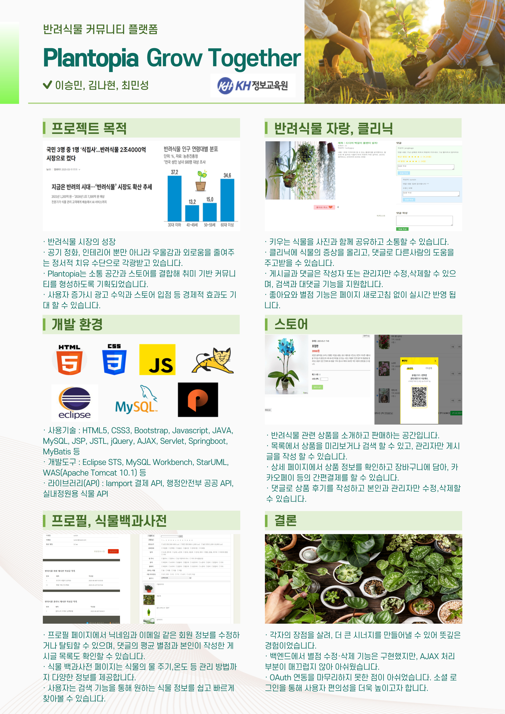
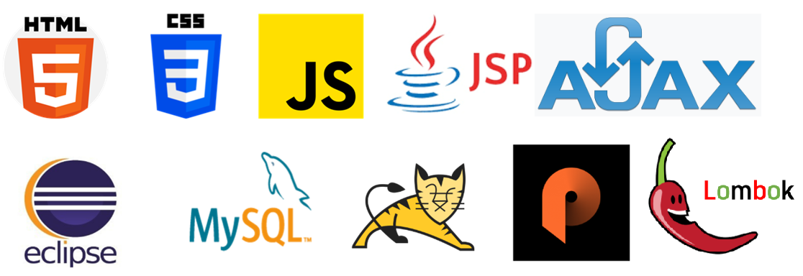

# Plantopia

프로젝트 기간 : 5/1~5/26  
(디지털컨버전스)자바(JAVA)프레임워크 공공데이터 융합 개발자

## 프로젝트 포스터

## 프로젝트 계획
1. 프로젝트 기획
   - 주제 선정, 일정 계획 작성
3. 프로젝트 설계
   - 데이터베이스 설계, 명세서, ER-Diagram 작성
5. 프로젝트 구현
6. 프로젝트 시연 및 발표

## 프로젝트 선정 배경
 - 반려식물 시장 성장에 따라, 식물을 키우는 사람들 간의 경험과 정보를 공유할 수 있는 소통의 장이 필요해졌습니다. 도시 생활속에서 자연과의 연결을 추구하는 사람들이 많아지면서 단순한 취미를 넘어 심리적 안정과 정서적 만족을 제공하는 중요한 존재로 자리 잡고 있습니다.
   
 - 반려동물에 관련 커뮤니티는 활성화되어 있는 반면, 반려식물을 주제로 한 커뮤니티는 상대적으로 드물다는 틈새시장을 공략 하였습니다. 이를 통해 사람들의 만족도를 높이고, 문화 확산에도 기여하고자 합니다.

## 기능 명세
### 일반 공통 기능
   1. 로그인/회원가입/프로필
   2. 게시판 목록 조회
      - 인기 게시글, 공지사항
      - 반려식물 자랑, 반려식물 클리닉
      - 스토어
   3. 식물 백과사전 이용
### user
   1. 회원정보 수정
   2. 자랑, 클리닉 게시판 이미지 업로드 및 글 작성,수정,삭제
   3. 게시글 좋아요
   4. 댓글 및 대댓글 작성
   5. 클리닉 댓글 별점 등록
   6. 댓글 별 평균 별점 및 나의 별점 확인
   7. 내가 작성한 글, 별점 확인
   8. 스토어 상품 장바구니 담기, 주문, 후기 작성
### admin
   1. 전체 회원 목록 조회 및 관리
   2. 게시글 및 댓글 관리
   3. 스토어 게시판 상품 등록 및 관리
   4. 공지사항 관리

## 개발 환경

- 사용기술 : HTML5, CSS3, Bootstrap, Javascript, UML, JAVA, MySQL, JSP, JSTL, JQuery, AJAX, Servlet, Springboot, MyBatis, Spring Security
- 개발도구 : Eclipse STS(Spring Tool Suite), Visual Studio Code, MySQL Workbench, StarUML, JDK21, WAS(Apache Tomcat 10.1), Dall e, Git, Github
- 라이브러리(API) : Iamport 결제 API, 행정안전부 공공 API, 실내정원용 식물 API

## 폴더 구조
> Plantopia  
> ├─ src/main/java  
> │   ├─ config  
> │   ├─ controller    
> │   ├─ dao  
> │   ├─ dto  
> │   ├─ service  
> ├─ src/main/resources  
> │   ├─ mybatis.mapper  
> │   ├─ static
> │   └─ application.properties
> ├─ src/main/webapp  
> │   └─ views      
> │   ├─　⋮   

- static  
> CSS, JS, 이미지 등 정적 파일 위치  
- application.properties  
> DB 접속 정보 등 전역 설정
 
## 결과
